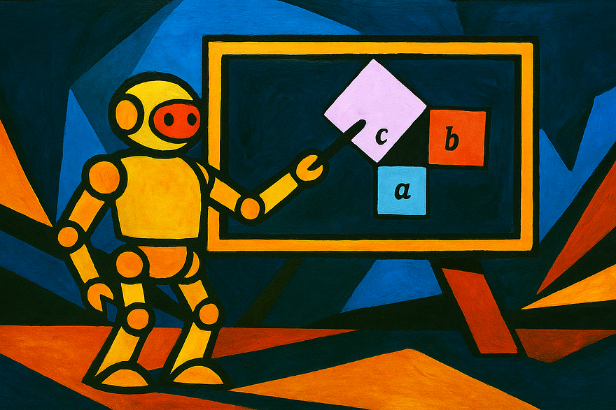

# Range Set Blaze in Lean

This repository accompanies the Medium article ["Vibe Validation with Lean, ChatGPT-5, & Claude 4.5: Nine Rules for Proving (Rust) Algorithms Correct Without Knowing Formal Methods"](https://medium.com/@carlmkadie/vibe-validation-with-lean-chatgpt-5-claude-4-5-nine-rules-for-proving-rust-algorithms-correct-without-knowing-formal-methods-56494bb2b119) by Carl Kadie.

The Lean sources here demonstrate the concepts and proofs discussed in the article. Feel free to explore, adapt, and build upon the material.

## License

The project is dual-licensed under the Apache License, Version 2.0 and the MIT License. You may use this code under the terms of either license. See `LICENSE-APACHE` and `LICENSE-MIT` for details.
